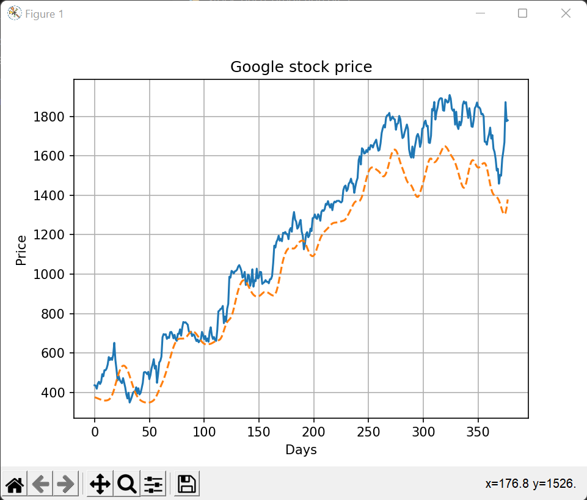

# Stock-price-prediction

This project was made as a part of UAceIT winter of mentorship.

# Picture of the results (the graph changes everyday)

## Stack used
The project is made in Python using librabies such as numpy, pandas, matplotlib and tensorflow LSTM.

## Week-wise Progress
week 1 - learnt about the basics of python
Week 2 - Introduction to numpy
Week 3 - Introduction to Pandas and Matplotlib
Week 4 - Long-Short Term memory
Week 5 - Worked on the mahchine learning model
Week 6 - Gave final touches to the project

## Future Scope
This project can further be made into a web application which will even allow users to predict the price of more than one stock.
